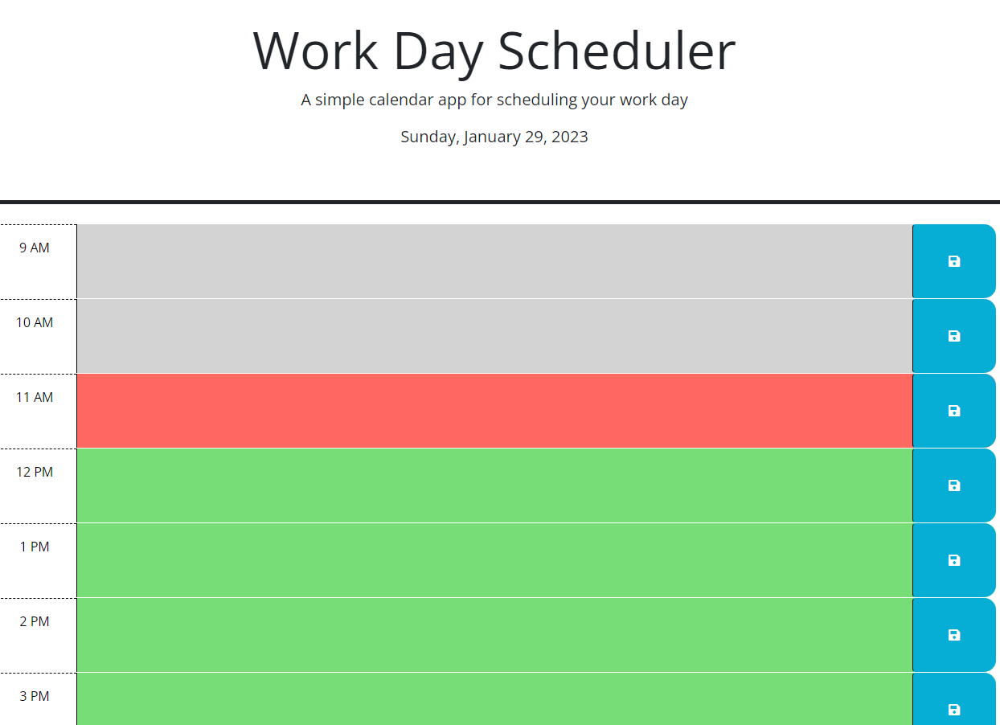

# Work-Day-Scheduler

## The links for my Project
[github page](https://github.com/Maha-Abdelnabi/Work-Day-Scheduler)

[deployed webpage](https://maha-abdelnabi.github.io/Generate-Password/)

# Descripton
this is a work day scheduler project as a bootcamp student.
The Work Day Scheduler has been built using HTML, CSS, and JavaScript. Much of the JavaScript coding consists of jQuery, jQueryUI and Day.js methods. 
## Usage
GIVEN a daily planner to create a schedule

WHEN  open the planner
THEN the current day is displayed at the top of the calendar

WHEN scroll down
THEN presented with timeblocks for standard business hours

WHEN view the timeblocks for that day
THEN each timeblock is color coded to indicate whether it is in the past, present, or future

WHEN  click into a timeblock
THEN  can enter an event

WHEN  click the save button for that timeblock
THEN the text for that event is saved in local storage

WHEN  refresh the page
THEN the saved events persist

